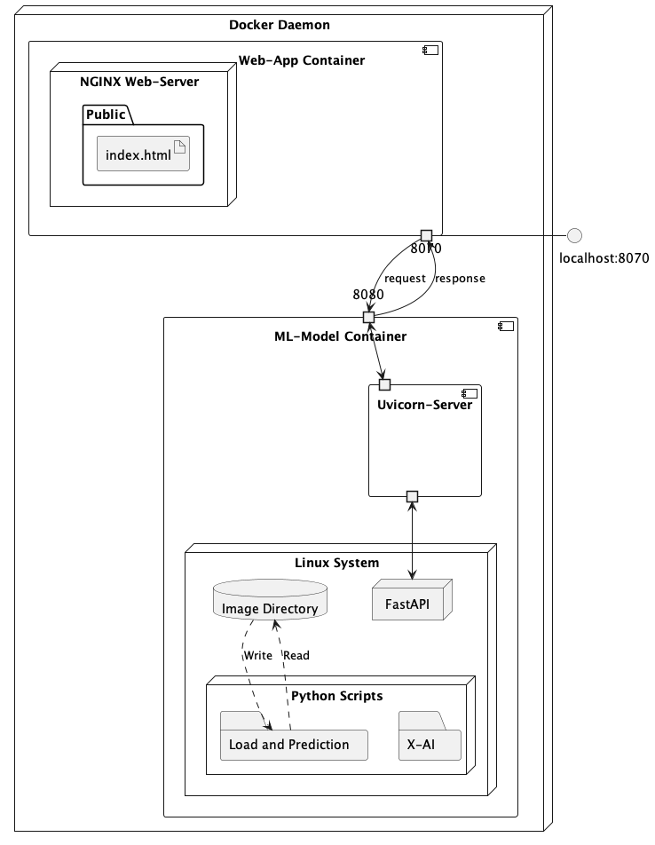

# API for ML classifiaction model

## Software Requirements

- Docker :whale:
- Python :snake:

## Structure

  
## How to use:

  
### 1. run docker commands
  
- move to the root directorty
  
```bash
docker compose up --build
```

### 2. open browser :

- Once it has started, you can open your browser to:
- localhost:8070        -> Interface for prediction     :[http://localhost:8070](http://localhost:8070)
- localhost:8080/docs   -> Interface for api testing    :[http://localhost:8080/docs](http://localhost:8080/docs)
